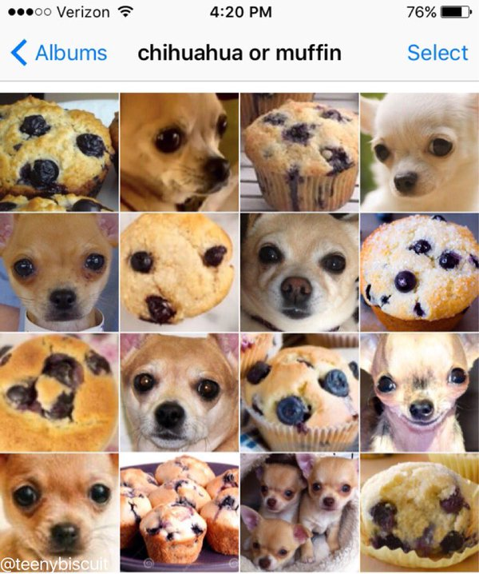
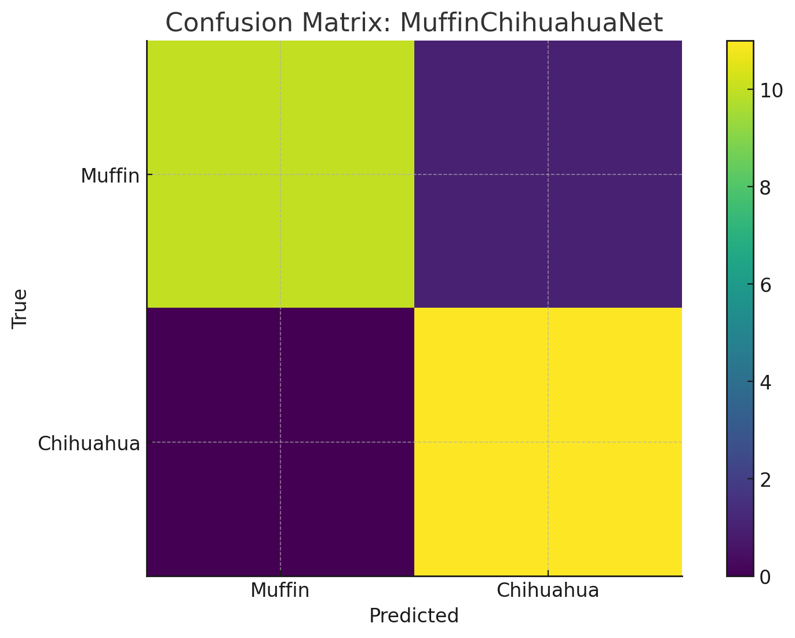
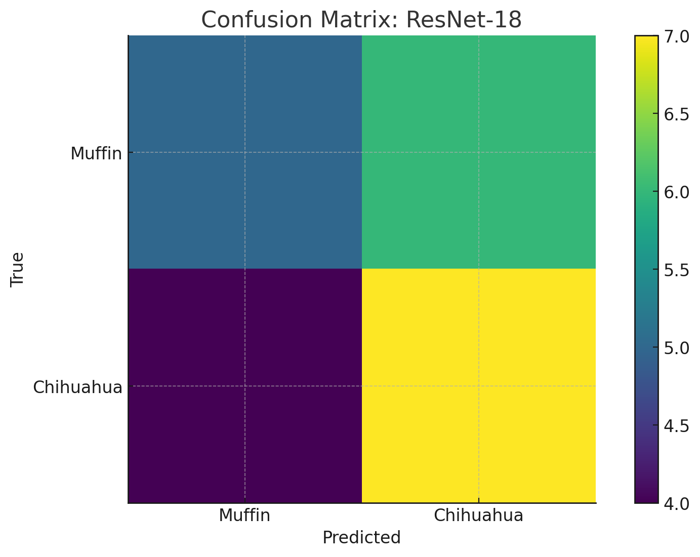
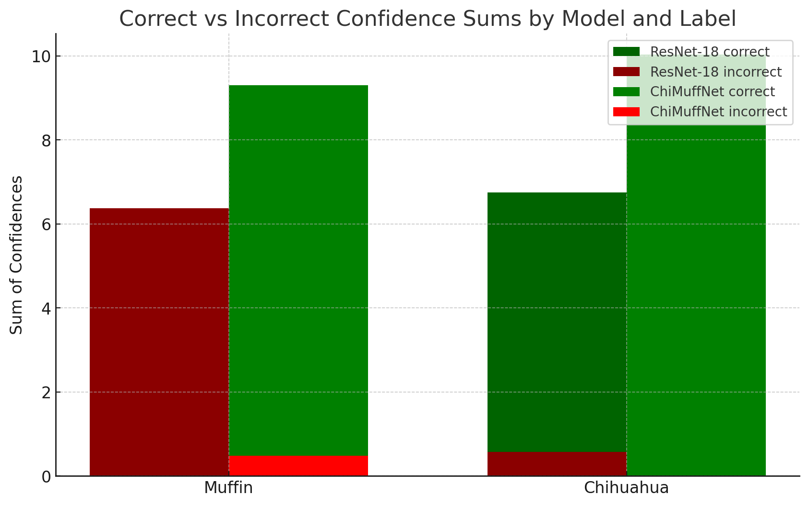

# **Muffin vs Chihuahua Detector**

This is an AI that can distinguish chihuahuas from muffins, and if you think it's easy just take a look at the image below



## Inference

Clone the repository:

```bash
git clone https://github.com/marks0kolov/ChiMuffNet.git
cd ChiMuffNet
```

Run inference on a new image with the provided python script:

```bash
python3 run_model.py --model model/model.onnx --labels model/labels.txt --input images/imagename.jpg
```

(don't forget to replace `imagename` with the actual image name)

The script will load the ONNX model, map output indices to class names using `labels.txt`, and print the predicted label and confidence. You can also batch-process a folder by passing its path to `--input` to scan all files in that directory.

## Training

Using the [`train.py`](https://github.com/dusty-nv/pytorch-classification/blob/3e9cf8c4003311009539a6c101d156c919fe2250/train.py) script from the [jetson-inference GitHub repo](https://github.com/dusty-nv/jetson-inference), I fine‑tuned an ImageNet‑pretrained ResNet‑18 on a dataset of around 9.3k chihuahua and blueberry muffin images. Training ran for 18 epochs to prevent overfitting.

## Results

To evaluate how much better is the new neural network compared to the old ResNet-18 i ran some tests and here is what i've got:

<div style="display:flex; flex-direction:row;align-items:flex-start;">
    
    
</div>
<br>
It is important to note the original ResNet-18 image model doesn't have a "muffin" class which is why i counted all of its answers as incorrect.<br>
However, as you can see, the new model boosts accuracy dramatically in classifying muffin images compared to the original ResNet-18, although still makes a few misclassifications.<br>
The performance on chihuahua images was pretty decent for both model; however, ResNet-18 still made a few mistakes, while the trained model didn't.<br>
So the overall performance definitely went up, although there is space for growth. Here you can see another graph demonstrating this:<br><br>



## Resources

- Datasets
    - Cortinhas, Samuel. *Muffin vs Chihuahua Image Classification Dataset*. Kaggle, 2023.  
    https://www.kaggle.com/datasets/samuelcortinhas/muffin-vs-chihuahua-image-classification/data

    - images.cv. *Chihuahua Image Classification Dataset*. n.d.  
    https://images.cv/dataset/chihuahua-image-classification-dataset

    - Lewtun. *Dog Food Dataset*. Hugging Face, 2021.  
    https://huggingface.co/datasets/lewtun/dog_food
- ResNet-18
- NVIDIA Jetson Orin Nano
- [jetson-inference GitHub repo](https://github.com/dusty-nv/jetson-inference)
